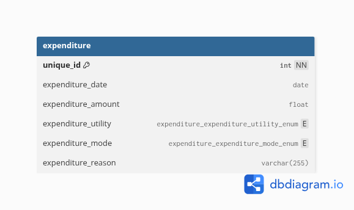

# Database Structure

This project uses a **MySQL** relational database to record and categorize individual expenditure events.  
The schema defines one core table, `expenditure`, along with two enumerations (`expenditure_utility_enum` and `expenditure_mode_enum`) that constrain categorical values for data consistency and integrity.

---

## Overview

| Table Name | Description | Primary Key | Rows (Approx.) |
|-------------|--------------|--------------|----------------|
| `expenditure` | Stores detailed records of individual spending events | `unique_id` | — |

| Enum Name | Description |
|------------|--------------|
| `expenditure_expenditure_utility_enum` | Defines permitted spending categories (e.g., travel, accommodation) |
| `expenditure_expenditure_mode_enum` | Defines payment modes used in each expenditure |

---

## Schema Details

### `expenditure`
Stores each expenditure record, capturing when, how, and why funds were spent.

| Column | Type | Description |
|---------|------|-------------|
| `unique_id` | INT (PK, NOT NULL) | Unique identifier for each expenditure record |
| `expenditure_date` | DATE | Date when the expenditure occurred |
| `expenditure_amount` | FLOAT | Amount spent in the transaction |
| `expenditure_utility` | ENUM (`TRAVEL`, `ACCOMMODATION`, `SUBSISTENCE`, `LEISURE`) | Category of expenditure purpose |
| `expenditure_mode` | ENUM (`CARD`, `CASH`, `UPI`) | Mode of payment used |
| `expenditure_reason` | VARCHAR(255) | Optional textual reason or note describing the expenditure |

---

## Enumerations

### `expenditure_expenditure_utility_enum`
Defines the possible **purpose categories** for each expenditure entry.

| Value | Description |
|--------|-------------|
| `TRAVEL` | Travel-related expenses (e.g., transport, tickets) |
| `ACCOMMODATION` | Lodging or accommodation costs |
| `SUBSISTENCE` | Daily living expenses such as food or groceries |
| `LEISURE` | Non-essential or entertainment spending |

---

### `expenditure_expenditure_mode_enum`
Defines the **method of payment** used in each transaction.

| Value | Description |
|--------|-------------|
| `CARD` | Payment made via debit or credit card |
| `CASH` | Physical cash transaction |
| `UPI` | Unified Payments Interface (digital payment) |

---

## 🧩 Relationships

This schema currently consists of a **single standalone table** (`expenditure`), with no foreign key dependencies.  
The two enumerations act as controlled vocabularies to ensure consistent data entry.

---

## 🧭 Diagram

> Diagram generated using [dbdiagram.io](https://dbdiagram.io)

---

## 📝 Notes

- The schema enforces strong data typing and referential integrity via ENUM definitions, ensuring consistent categorical data.  
- `NULL` defaults are allowed in non-key columns, accommodating partial or incomplete records.  
- Suitable for personal finance tracking, expense analysis, or cost-reporting applications.

---
